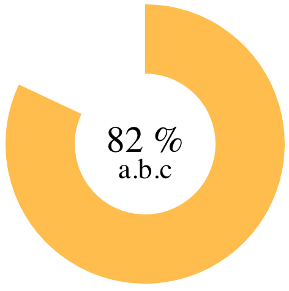

# vue-pie-chart
```html
<pie-chart :percent=80 label-small="a.b.c" />
```



[Demo](https://arve0.github.io/vue-pie-chart/).

## Install
```sh
npm i vue-pie-chart
```

## Usage
Register as global component:
```js
import PieChart from 'vue-pie-chart'

// register globally
Vue.component('pie-chart', PieChart)

// or register in your Vue instance
new Vue({
  components: {
    'pie-chart': PieChart
  }
})
```

Then use it in template, here shown with default attributes:
```html
<pie-chart
  :ratio=0.42
  :percent=42
  :stroke-width=1
  label="42 %"
  label-small=""
  color=#40a070
  :opacity=0.7
/>
```

### Attributes
#### ratio: `Number`
Size of pie chart. `1` is a cirle, `0.5` is a half circle. Pie will rotate clock-wise if positive, and counter-clock-wise if negative. Wraps when absolute value is above 1.

#### percent: `Number`
Size of pie chart. `100` is a cirle, `50` is a half circle. Pie will rotate clock-wise if positive, and counter-clock-wise if negative. Wraps when absolute value is above 100. If both percent and ratio is given, ratio is used.

#### stroke-width: `Number`
Size of bar. Should be above 0 and below 10. 10 will completely fill the pie to the center.

#### label: `String`
Text inside pie chart. Defaults to percent if not given.

#### label-small: `String`
Small label below main label. Defaults to empty string if not given.

#### color: `String`
Color of pie chart.

#### opacity: `Number`
Opacity of pie chart.

## Dev Setup

``` sh
git clone https://github.com/arve0/vue-pie-chart
cd vue-pie-chart

# install dependencies
npm install

# serve with hot reload at localhost:8080
npm run dev

# build for production with minification
npm run build
```

For detailed explanation on how things work, consult the [docs for vue-loader](http://vuejs.github.io/vue-loader).

## License
MIT
